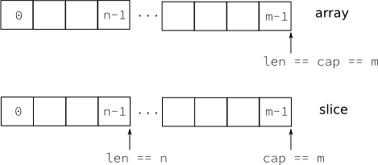

{.epigraph}
> I am interested in this and hope to do something.
Quote: On adding complex numbers to Go -- Ken Thompson

In this chapter we will look at the basic building blocks of the Go programming
language.

## Hello World
In the Go tutorial, you get started with Go in the typical manner: printing
"Hello World" (Ken Thompson and Dennis Ritchie started this when they presented
the C language in the 1970s). That's a great way to start, so here it is, "Hello
World" in Go.

{callout="//"}
<{{src/basics/helloworld.go}}

Lets look at the program line by line. This first line is just required <1>. All
Go files start with `package <something>`, and `package main` is required for
a standalone executable.

`import "fmt"` says we need `fmt` in addition to `main` <2>. A package other
than `main` is commonly called a library, a familiar concept in many programming
languages (see (#packages)). The line ends with a comment that begins with `//`.

Next we another comment, but this one is enclosed in `/*` `*/` <3>. When your Go
program is executed, the first function called will be `main.main()`, which
mimics the behavior from C. Here we declare that function <4>.

Finally we call a function from the package `fmt` to print a string to the
screen. The string is enclosed with `"` and may contain non-ASCII characters
<5>.

## Compiling and Running Code
To build a Go program, use the `go` tool.(((tooling,go)))
To build `helloworld` we just enter:

    % go build helloworld.go

(((tooling,go build)))
This results in an executable called `helloworld`. (((tooling,go run)))

    % ./helloworld
    Hello, world.

You can combine the above and just call `go run helloworld.go`.

## Variables, Types and Keywords
In the next few sections we will look at the variables, basic types, keywords,
and control structures of our new language.

Go is different from (most) other languages in that the type of a variable is
specified *after* the variable name. So not: `int a`, but `a int`. When you
declare a variable it is assigned the "natural" null value for the type. This
means that after `var a int`, `a` has a value of 0. With `var s string`, `s` is
assigned the zero string, which is `""`. Declaring and assigning in Go is a two
step process, but they may be combined. Compare the following pieces of code
which have the same effect. (((variables,declaring))) (((variables,assigning)))

~~~go
var a int                           a := 15
var b bool                          b := false
a = 15
b = false
~~~

On the left we use the `var` keyword to declare a variable and *then* assign
a value to it. The code on the right uses `:=` to do this in one step (this form
may only be used *inside* functions). In that case the variable type is
*deduced* from the value. A value of 15 indicates an `int`. A value of `false`
tells Go that the type should be `bool`. Multiple `var` declarations may also
be grouped; `const` (see (#constants)) and `import` also allow this. Note the
use of parentheses instead of braces:

~~~go
var (
    x int
    b bool
)
~~~

Multiple variables of the same type can also be declared on a single line: `var
x, y int` makes `x` and `y` both `int` variables. You can also make use of
*parallel assignment*(((variables, parallel assignment))): `a, b := 20, 16`.
This makes `a` and `b` both integer variables and assigns
20 to `a` and 16 to `b`.

A special name for a variable is `_`. (((variables,underscore))) Any value
assigned to it is discarded (it's similar to `/dev/null` on Unix). In this
example we only assign the integer value of 35 to `b` and discard the value 34:
`_, b := 34, 35`. Declared but otherwise *unused* variables are a compiler error
in Go.

### Boolean Types
A boolean type represents the set of boolean truth values denoted by the
predeclared constants *true* and *false*. The boolean type is `bool`.

### Numerical Types
Go has most of the well-known types such as `int`. The `int` type has the
appropriate length for your machine, meaning that on a 32-bit machine it is 32
bits and on a 64-bit machine it is 64 bits. Note: an `int` is either 32 or 64
bits, no other values are defined. Same goes for `uint`, the unsigned int.

If you want to be explicit about the length, you can have that too, with
`int32`, or `uint32`. The full list for (signed and unsigned) integers is
`int8`, `int16`, `int32`, `int64` and `byte`, `uint8`, `uint16`, `uint32`,
`uint64`, with `byte` being an alias for `uint8`. For floating point values
there is `float32` and `float64` (there is no `float` type). A 64 bit integer or
floating point value is *always* 64 bit, also on 32 bit architectures.

Note that these types are all distinct and assigning variables which mix these
types is a compiler error, like in the following code:

<{{src/basics/types.go}}

We declare two different integers, a and b where a is an `int` and b is an
`int32`. We want to set b to the sum of a and a. This fails and gives the error:
`cannot use a + a (type int)  as type int32 in assignment`. Adding the constant
5 to b *does* succeed, because constants are not typed.

### Constants

Constants in Go are just that --- constant. They are created at compile time,
and can only be numbers, strings, or booleans; `const x = 42` makes `x`
a constant. You can use
*iota*(((keywords, iota))) ^[The word iota is used in a common English phrase,
'not one iota', meaning 'not the slightest difference', in reference to
a phrase in the New Testament: "*until heaven and earth pass away, not an iota,
not a dot, will pass from the Law*." [@iota]] to enumerate values.

~~~go
const (
    a = iota
    b
)
~~~

The first use of `iota` will yield 0, so `a` is equal to 0. Whenever `iota` is
used again on a new line its value is incremented with 1, so `b` has a value of 1.
Or, as shown here, you can even let Go repeat the use of `iota`. You may also
explicitly type a constant: `const b string = "0"`. Now `b` is a `string` type
constant.

### Strings
Another important built-in type is `string`. Assigning a string is as simple as:

~~~go
s := "Hello World!"
~~~

Strings in Go are a sequence of UTF-8 characters enclosed in double quotes (").
If you use the single quote (') you mean one character (encoded in UTF-8) ---
which is *not* a `string` in Go.

Once assigned to a variable, the string cannot be changed: strings in Go are
immutable. If you are coming from C, note that the following is not legal in Go:

~~~go
var s string = "hello"
s[0] = 'c'
~~~

To do this in Go you will need the following:

{callout="//"}
~~~go
s := "hello"
c := []rune(s)	    //<1>
c[0] = 'c'	        //<2>
s2 := string(c)     //<3>
fmt.Printf("%s\n", s2) //<4>
~~~

Here we convert `s` to an array of runes <1>. We change the first element of
this array <2>. Then we create a *new* string `s2` with the alteration <3>.
Finally, we print the string with `fmt.Printf` <4>.

### Runes
`Rune` is an alias for `int32`. It is an UTF-8 encoded code point. When is this
type useful? (((runes))) One example is when you're iterating over characters in
a string. You could loop over each byte (which is only equivalent to a character
when strings are encoded in 8-bit ASCII, which they are *not* in Go!). But to
get the actual characters you should use the `rune` type.

### Complex Numbers
Go has native support for complex numbers. To use them you need a variable of
type `complex128` (64 bit real and imaginary parts) or `complex64` (32 bit real
and imaginary parts). Complex numbers are written as `re + im`$$i$$, where `re`
is the real part, `im` is the imaginary part and $$i$$ is the literal '$$i$$'
($$\sqrt{-1}$$).

### Errors
Any non-trivial program will have the need for error reporting sooner or later.
Because of this Go has a builtin type specially for errors, called `error`. `var
e error` creates a variable `e` of type `error` with the value `nil`. This error
type is an interface -- we'll look more at interfaces in (#interfaces). For
now you can just assume that `error` is a type just like all other types.

## Operators and Built-in Functions

Go supports the normal set of numerical operators. See (#tab-op-precedence)
for lists the current ones and their relative precedence. They all associate from
left to right.

{#tab-op-precedence}
{{tab/precedence.md}}

`+ - * /` and `%` all do what you would expect, `& | ^` and `&^` are bit
operators for bitwise *and*(((operators, bitwise and))), bitwise
*or*(((operators, bitwise or))), bitwise *xor*(((operators, bit wise xor))), and
bit clear (((operators, bitwise clear))) respectively. The `&&` and `||`
operators are logical *and* (((operators, and))) and logical *or* (((operators,
or))). Not listed in the table is the logical not (((operators, not))): `!`

Although Go does not support operator overloading (or method overloading for
that matter), some of the built-in operators *are* overloaded. For instance, `+`
can be used for integers, floats, complex numbers and strings (adding strings is
concatenating them).

## Go Keywords
Let's start looking at keywords, (#tab-keywords) lists all the keywords in
Go.

{#tab-keywords}
{{tab/keywords.md}}

We've seen some of these already. We used `var` and `const` in the (#variables-types-and-keywords)
section,  and we briefly looked at `package` and `import` in our "Hello World"
program at the start of the chapter. Others need more attention and have their
own chapter or section:

* `func` is used to declare functions and methods.
* `return` is used to return from functions. We'll look at both `func` and `return` in detail in (#functions).
* `go` is used for concurrency. We'll look at this in (#channels).
* `select` used to choose from different types of communication, We'll work with `select` in (#channels).
* `interface` is covered in (#interfaces).
* `struct` is used for abstract data types. We'll work with `struct` in (#beyond-the-basics).
* `type` is also covered in (#beyond-the-basics).

## Control Structures
There are only a few control structures in Go. To write loops we use the `for`
keyword, and there is a `switch` and of course an `if`. When working with
channels `select` will be used (see (#channels)). Parentheses are are not
required around the condition, and the body must *always* be brace-delimited.

### If-Else
In Go an `if` (((keywords, if))) looks like this:

~~~go
if x > 0 {
    return y
} else {
    return x
}
~~~

(((keywords,return))) (((keywords,else))) Since `if` and `switch` accept an
initialization statement, it's common to see one used to set up a (local)
variable.

~~~go
if err := SomeFunction(); err == nil {
    // do something
} else {
    return err
}
~~~

It is idomatic in Go to omit the `else` when the `if` statement's body has
a `break`, `continue`, `return` or, `goto`, so the above code would be better
written as:

~~~go
if err := SomeFunction(); err != nil {
    return err
}
// do something
~~~

The opening brace on the first line must be positioned on the same line as the
`if` statement. There is no arguing about this, because this is what `gofmt`
outputs.

### Goto
Go has a `goto` (((keywords, goto))) statement - use it wisely. With `goto` you
jump to a (((label))) label which must be defined within the current function.
For instance, a loop in disguise:

~~~go
func myfunc() {
    i := 0
Here:
    fmt.Println(i)
    i++
    goto Here
}
~~~

The string `Here:` indicates a label. A label does not need to start with
a capital letter and is case sensitive.

### For
The Go `for` (((keywords, for))) loop has three forms, only one of which has
semicolons:

* `for init; condition; post { }` - a loop using the syntax borrowed from C;
* `for condition { }` - a while loop, and;
* `for { }` - an endless loop.

Short declarations make it easy to declare the index variable right in the loop.

~~~go
sum := 0
for i := 0; i < 10; i++ {
    sum = sum + i
}
~~~

Note that the variable `i` ceases to exist after the loop.

### Break and Continue
With `break` (((keywords, break))) you can quit loops early.  By itself, `break`
breaks the current loop.

{callout="//"}
~~~go
for i := 0; i < 10; i++ {
    if i > 5 {
    break //<1>
    }
    fmt.Println(i) //<2>
}
~~~

Here we `break` the current loop <1>, and don't continue with the
`fmt.Println(i)` statement <2>. So we only print 0 to 5. With loops within loop
you can specify a label after `break` to identify *which* loop to stop:

{callout="//"}
~~~go
J:  for j := 0; j < 5; j++ { //<1>
        for i := 0; i < 10; i++ {
            if i > 5 {
                break J //<2>
            }
            fmt.Println(i)
        }
    }
~~~

Here we define a label "J" <1>, preceding the `for`-loop there. When we use
`break J` <2>, we don't break the inner loop but the "J" loop.

With `continue` (((keywords, continue))) you begin the next iteration of the
loop, skipping any remaining code. In the same way as `break`, `continue` also
accepts a label.

### Range
The keyword `range` (((keywords, range))) can be used for loops. It can loop
over slices, arrays, strings, maps and channels (see (#channels)). `range` is an
iterator that, when called, returns the next key-value pair from the "thing" it
loops over. Depending on what that is, `range` returns different things.

When looping over a slice or array, `range` returns the index in the slice as
the key and value belonging to that index. Consider this code: (((keywords, range)))

~~~go
list := []string{"a", "b", "c", "d", "e", "f"}
for k, v := range list {
    // do something with k and v
}
~~~

First we create a slice of strings. Then we use `range` to loop over them. With
each iteration, `range` will return the index as an `int` and the key as
a `string`. It will start with 0 and "a", so `k` will be 0 through 5, and v will
be "a" through "f".

You can also use `range` on strings directly. Then it will break out the
individual Unicode characters ^[In the UTF-8 world characters are sometimes
called *runes* (((runes))).] Mostly, when people talk about characters, they
mean 8 bit characters. As UTF-8 characters may be up to 32 bits the word rune is
used. In this case the type of `char` is `rune`. and their start position, by
parsing the UTF-8. The loop: (((keywords,range)))

~~~go
for pos, char := range "Gő!" {
    fmt.Printf("character '%c' starts at byte position %d\n", char, pos)
}
~~~

prints

    character 'G' starts at byte position 0
    character 'ő' starts at byte position 1
    character '!' starts at byte position 3

Note that `ő` took 2 bytes, so '!' starts at byte 3.

### Switch
Go's `switch` (((keywords, switch))) is very flexible; you can match on much
more than just integers. The cases are evaluated top to bottom until a match is
found, and if the `switch` has no expression it switches on `true`. It's
therefore possible -- and idiomatic -- to write an `if-else-if-else` chain as
a `switch`.

{callout="//"}
~~~go
// Convert hexadecimal character to an int value
switch { //<1>
case '0' <= c && c <= '9': //<2>
    return c - '0' //<3>
case 'a' <= c && c <= 'f': //<4>
    return c - 'a' + 10
case 'A' <= c && c <= 'F': //<5>
    return c - 'A' + 10
}
return 0
~~~

A `switch` without a condition is the same as `switch true` <1>. We list the
different cases. Each `case` statement has a condition that is either true of
false. Here <2> we check if `c` is a number. If `c` is a number we return its
value <3>. Check if `c` falls between "a" and "f" <4>. For an "a" we
return 10, for "b" we return 11, etc. We also do the same <5> thing for "A"
to "F".

There is no automatic fall through, you can use `fallthrough` (((keywords,
fallthrough))) for that.

{callout="//"}
~~~go
switch i {
    case 0:  fallthrough
    case 1: //<1>
        f()
    default:
        g() //<2>
~~~

`f()` can be called when `i == 0` <1>. With `default` (((keywords, default))) you
can specify an action when none of the other cases match. Here `g()` is called
when `i` is not 0 or 1 <2>. We could rewrite the above example as:

{callout="//"}
~~~go
switch i {
    case 0, 1: //<1>
        f()
    default:
        g()
~~~

You can list cases on one line <1>, separated by commas.

## Built-in Functions
A few functions are predefined, meaning you *don't* have to include any package
to get access to them. (#tab-predef-functions) lists them all.^[You can
use the command `godoc builtin` to read the online documentation about the
built-in types and functions.]

{#tab-predef-functions}
{{tab/functions.md}}

These built-in functions are documented in the `builtin` (((package,builtin)))
pseudo package that is included in recent Go releases. Let's go over these
functions briefly.

`close`
:   is used in channel communication. It closes a channel. We'll learn more about this in (#channels).
    (((built-in,close)))

`delete`
:   is used for deleting entries in maps. (((built-in,delete)))

`len` and `cap`
:   are used on a number of different types, `len` is
    used to return the lengths of strings, slices, and
    arrays. In the next section (#arrays) we'll look at slices,
    arrays and the function `cap`.(((built-in,len)))(((built-in,cap)))

`new`
:   is used for allocating memory for user defined
    data types. See (#allocation-with-new).
    (((built-in,new)))

`make`
:   is used for allocating memory for built-in
    types (maps, slices, and channels). See (#allocation-with-make).
    (((built-in,make)))

`copy`, `append`
:   `copy` is for copying slices. (((built-in,copy)))
    And `append` is for concatenating slices. See (#slices) in this chapter. (((built-in,append)))

`panic`, `recover`
:   are used for an *exception* mechanism. See (#panic-and-recovering) for more.
    (((built-in,panic)))
    (((built-in,recover)))

`print`, `println`
:   are low level printing functions that can be used without reverting to the
    `fmt` (((package,fmt))) package. These are mainly used for debugging.
    (((built-in,print)))(((built-in,println)))

`complex`, `real`, `imag`
:   all deal with complex numbers. (((complex numbers))) We will not use complex numbers in this book.
    (((built-in,complex)))
    (((built-in,real)))
    (((built-in,imag)))

## Arrays, Slices, and Maps
To store multiple values in a list, you can use arrays, or their more flexible
cousin: slices. A dictionary or hash type is also available. It is called
a `map` in Go.

### Arrays
An array is defined by: `[n]<type>`, where $$n$$ is the length of the array and
`<type>` is the stuff you want to store. To assign or index an element in the
array, you use square brackets:

~~~go
var arr [10]int
arr[0] = 42
arr[1] = 13
fmt.Printf("The first element is %d\n", arr[0])
~~~

Array types like `var arr [10]int` have a fixed size. The size is *part* of the
type. They can't grow, because then they would have a different type. Also
arrays are values: Assigning one array to another *copies* all the elements. In
particular, if you pass an array to a function it will receive a copy of the
array, not a pointer to it.

(((array,multidimensional))) To declare an array you can use the following: `var
a [3]int`. To initialize it to something other than zero, use a
*composite literal* (((literal, composite))): `a := [3]int{1, 2, 3}`. This can
 be shortened to `a := [...]int{1, 2, 3}`, where Go counts the elements
 automatically.

A> A composite literal allows you
A> to assign a value directly to an array, slice, or map.
A> See (#constructors-and-composite-literals) for more information.

When declaring arrays you *always* have to type something in between the square
brackets, either a number or three dots (`...`), when using a composite literal.
When using multidimensional arrays, you can use the following syntax: `a :=
[2][2]int{ {1,2}, {3,4} }`. Now that you know about arrays you will be delighted
to learn that you will almost never use them in Go, because there is something
much more flexible: slices.

### Slices
A slice is similar to an array, but it can grow when new elements are added.
A slice always refers to an underlying array. What makes slices different from
arrays is that a slice is a pointer *to* an array; slices are reference
types.(((reference types)))

A> Reference types are created with `make`. We detail this further
A> in (#beyond-the-basics).

That means that if you assign one slice to another, both refer to the *same*
underlying array. For instance, if a function takes a slice argument, changes it
makes to the elements of the slice will be visible to the caller, analogous to
passing a pointer to the underlying array. With: `slice := make([]int, 10)`, you
create a slice which can hold ten elements. Note that the underlying array isn't
specified. A slice is always coupled to an array that has a fixed size. For
slices we define a capacity (((slice,capacity))) and a length
(((slice,length))). (#fig-array-vs-slice) shows the creation of an array,
then the creation of a slice. First we create an array of $$m$$ elements of the
type `int`: `var array[m]int` .

Next, we create a slice from this array: `slice := array[:n]` . And now we have:

* `len(slice) == n`
* `cap(slice) == m`
* `len(array) == cap(array) == m`

{#fig-array-vs-slice}

Given an array, or another slice, a new slice is created via `a[n:m]`. This
creates a new slice which refers to the variable `a`, starts at index `n`, and
ends before index `m`. It has length `n - m`.

{callout="yes"}
~~~go
a := [...]int{1, 2, 3, 4, 5} <1>
s1 := a[2:4] <2>
s2 := a[1:5] <3>
s3 := a[:]   <4>
s4 := a[:4]  <5>
s5 := s2[:] <6>
s6 := a[2:4:5] <7>
~~~

<!-- Double check this -->
First we define <1> an array with five elements, from index 0 to 4.
From this we create <2> a slice with the elements from index 2 to 3, this slices contains: `3, 4`.
Then we we create another slice <3> from `a`: with the elements from index 1 to 4,
this contains: `2, 3, 4, 5`.
With `a[:]` <4> we create a slice with all the elements in the array. This is a shorthand for: `a[0:len(a)]`.
And with `a[:4]` <5> we create a slice with the elements from index
0 to 3, this is short for: `a[0:4]`, and gives us a slices that contains: `1, 2, 3, 4`.
With `s2[:]` we create a slice from the slice `s2` <6>, note that `s5` still refers to the array `a`.
Finally, we create a slice with the elements from index 3 to 3 *and* also set the cap to 4 <7>.

When working with slices you can overrun the bounds, consider this code.

{callout="//"}
<{{src/basics/array-and-slices.go}}

At <1> we create an array with a 100 elements, indexed from 0 to 99. Then at <2>
we create a slice that has index 0 to 98. We assign 1 to the 99th element <3> of
the slice. This works as expected. But at <4> we dare to do the impossible, and
and try to allocate something beyond the length of the slice and we are greeted
with a *runtime* error: `Error: "throw: index out of range".`

If you want to extend a slice, there are a couple of built-in functions that
make life easier: `append` and `copy`. The append function appends zero or more
values to a slice and returns the result: a slice with the same type as the
original. If the original slice isn't big enough to fit the added values, append
will allocate a new slice that is big enough. So the slice returned by append
may refer to a different underlying array than the original slice does. Here's
an example: (((built-in,append)))

{callout="//"}
~~~go
s0 := []int{0, 0}
s1 := append(s0, 2) //<1>
s2 := append(s1, 3, 5, 7) //<2>
s3 := append(s2, s0...) //<3>
~~~

At <1> we append a single element, making `s1` equal to `[]int{0, 0, 2}`. At <2>
we append multiple elements, making `s2` equal to `[]int{0, 0, 2, 3, 5, 7}`. And
at <3> we append a slice, giving us `s3` equal to `[]int{0, 0, 2, 3, 5, 7, 0, 0}`.
Note the three dots used after `s0...`! This is needed make it clear
  explicit that you're appending another slice, instead of a single value.

The copy function copies slice elements from a source to a destination, and
returns the number of elements it copied. This number is the minimum of the
length of the source and the length of the destination. For example:
(((built-in,copy)))

{callout="//"}
~~~go
var a = [...]int{0, 1, 2, 3, 4, 5, 6, 7}
var s = make([]int, 6)
n1 := copy(s, a[0:]) // <1>
n2 := copy(s, s[2:]) // <2>
~~~

After <1>, `n1` is 6, and `s` is `[]int{0, 1, 2, 3, 4, 5}`.
And after <2>, `n2` is 4, and `s` is `[]int{2, 3, 4, 5, 4, 5}`.

### Maps
Many other languages have a type similar to maps built-in. For instance, Perl
has hashes, Python has its dictionaries, and C++ also has maps (as part of the
libraries). In Go we have the `map` (((keywords, map))) type. A `map` can be
thought of as an array indexed by strings (in its most simple form).

{callout="//"}
~~~go
monthdays := map[string]int{
    "Jan": 31, "Feb": 28, "Mar": 31,
    "Apr": 30, "May": 31, "Jun": 30,
    "Jul": 31, "Aug": 31, "Sep": 30,
    "Oct": 31, "Nov": 30, "Dec": 31, //<1>
}
~~~

The general syntax for defining a map is `map[<from type>]<to type>`. Here, we
define a map that converts from a `string` (month abbreviation) to an `int`
(number of days in that month). Note that the trailing comma at <1> is
*required*.

Use `make` when only declaring a map: `monthdays := make(map[string]int)`. A map
is a reference type.

For indexing ("searching") the map, we use square brackets. For example, suppose
we want to print the number of days in December: `fmt.Printf("%d\n",
monthdays["Dec"])`

If you are looping over an array, slice, string, or map a, `range` (((keywords,
range))) clause will help you again, it returns the key and corresponding value
with each invocation.

{callout="//"}
~~~go
year := 0
for _, days := range monthdays //<1>
    year += days
}
fmt.Printf("Numbers of days in a year: %d\n", year)
~~~

At <1> we use the underscore to ignore (assign to nothing) the key returned by
`range`. We are only interested in the values from `monthdays`.

(((keywords, map adding elements)))

To add elements to the map, you would add new month with: `monthdays["Undecim"]
= 30`. If you use a key that already exists, the value will be silently
overwritten: `monthdays["Feb"] = 29`. To test for existence (((keywords, map
existence))), you would use the following: `value, present := monthdays["Jan"]`.
If the key "Jan" exists, `present` will be true. It's more Go like to name
`present` "ok", and use: `v, ok := monthdays["Jan"]`. In Go we call this the
"comma ok" form.

You can remove elements (((keywords, map remove elements))) from the `map`:
`delete(monthdays, "Mar")` ^[Always rainy in March anyway.]. In general the
syntax `delete(m, x)` will delete the map entry retrieved by the expression
`m[x]`.

## Exercises
{{ex/basics/ex.md}}
